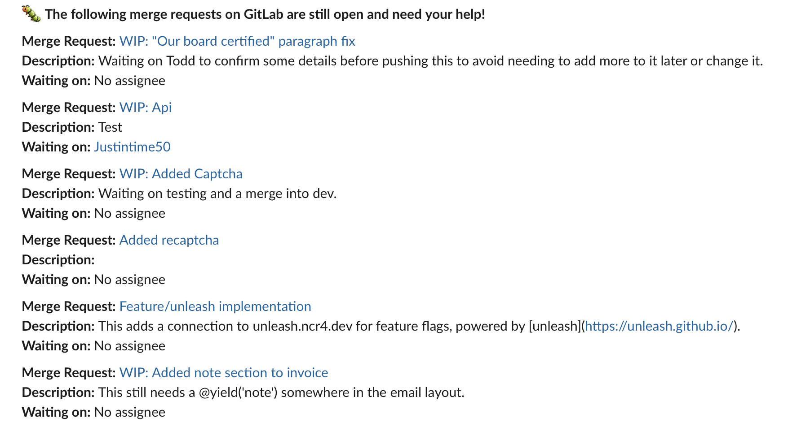

<div align="center">

# Pullbug 🐛 

Get bugged via Slack or RocketChat to merge your GitHub pull requests or GitLab merge requests.

[](https://travis-ci.com/Justintime50/pullbug)
[](https://coveralls.io/github/Justintime50/pullbug?branch=master)
[](https://pypi.org/project/pullbug)
[](LICENSE)



</div>

Pullbug can notify you on Slack or Rocket.Chat of all open pull and merge requests from GitHub or GitLab. This tool ensures requests never go unnoticed as it can be setup on a schedule to constantly bug you to merge your work. This is perfect for finding old or stale requests and helps you to stay current on new ones. Pass in a few environment variables, setup a [Slackbot](https://slack.com/help/articles/115005265703-Create-a-bot-for-your-workspace) or [Rocket.Chat](https://rocket.chat/docs/developer-guides/rest-api/integration/create/) integration and you're all set to be bugged by Pullbug.

**NOTE:** Pullbug works best if you have link unfurling turned off for GitHub and GitLab on Slack or Rocket.Chat.

**GitLab Users:** If you are not hosting your own GitLab instance and are instead using `gitlab.com`, it's recommended to change the scope to `owner` and provide an owner who has access to all your organizations merge requests.

## Install

```bash
# Install tool
pip3 install pullbug

# Install locally
make install

# Get Makefile help
make help
```

## Usage

Pullbug works best when run on a schedule. Run one-off reports or setup Pullbug to notify you at whatever interval you'd like to be bugged via Slack or Rocket.Chat about pull or merge requests.

Pullbug is highly customizable allowing you to mix and match version control software along with messaging platforms to get the right fit. Additionally choose which kinds of pull or merge requests to retrieve.

```
Usage:
    GITHUB_TOKEN=123... SLACK_BOT_TOKEN=123... SLACK_CHANNEL=my-channel pullbug --github --github_owner my_org --slack

Options:
    -h, --help            show this help message and exit
    -gh, --github         Get bugged about pull requests from GitHub.
    -gl, --gitlab         Get bugged about merge requests from GitLab.
    -s, --slack           Send Pullbug messages to Slack.
    -rc, --rocketchat     Send Pullbug messages to Rocket.Chat.
    -w, --wip             Include "Work in Progress" pull or merge requests.
    -gho GITHUB_OWNER, --github_owner GITHUB_OWNER
                            The GitHub owner to retrieve pull requests from (can be a user or org).
    -ghs GITHUB_STATE, --github_state GITHUB_STATE
                            The GitHub state to retrieve pull requests with. (Default: open | closed | all)
    -ghc GITHUB_CONTEXT, --github_context GITHUB_CONTEXT
                            The GitHub context to retrieve pull requests with (Default: orgs | users).
    -glst GITLAB_STATE, --gitlab_state GITLAB_STATE
                            The GitLab state to retrieve merge requests with. (Default: opened | closed | locked | merged)
    -glsc GITLAB_SCOPE, --gitlab_scope GITLAB_SCOPE
                            The GitLab state to retrieve pull requests with. (Default: all | created_by_me | assigned_to_me)

Environment Variables:
    GITHUB_TOKEN        The GitHub Token used to authenticate with the GitHub API.
    GITLAB_API_KEY      The GitLab API Key used to authenticate with the GitLab API.
    GITLAB_API_URL      The GitLab API url for your GitLab instance. Default: https://gitlab.com/api/v4.
    SLACK_BOT_TOKEN     The Slackbot Token used to authenticate with Slack.
    SLACK_CHANNEL       The Slack channel to post a message to.
    ROCKET_CHAT_URL     The Rocket.Chat url of the room to post a message to.
```

## Development

```bash
# Lint the project
make lint

# Run tests
make test

# Run test coverage
make coverage

# Run the tool locally
venv/bin/python pullbug/cli.py --help
```
